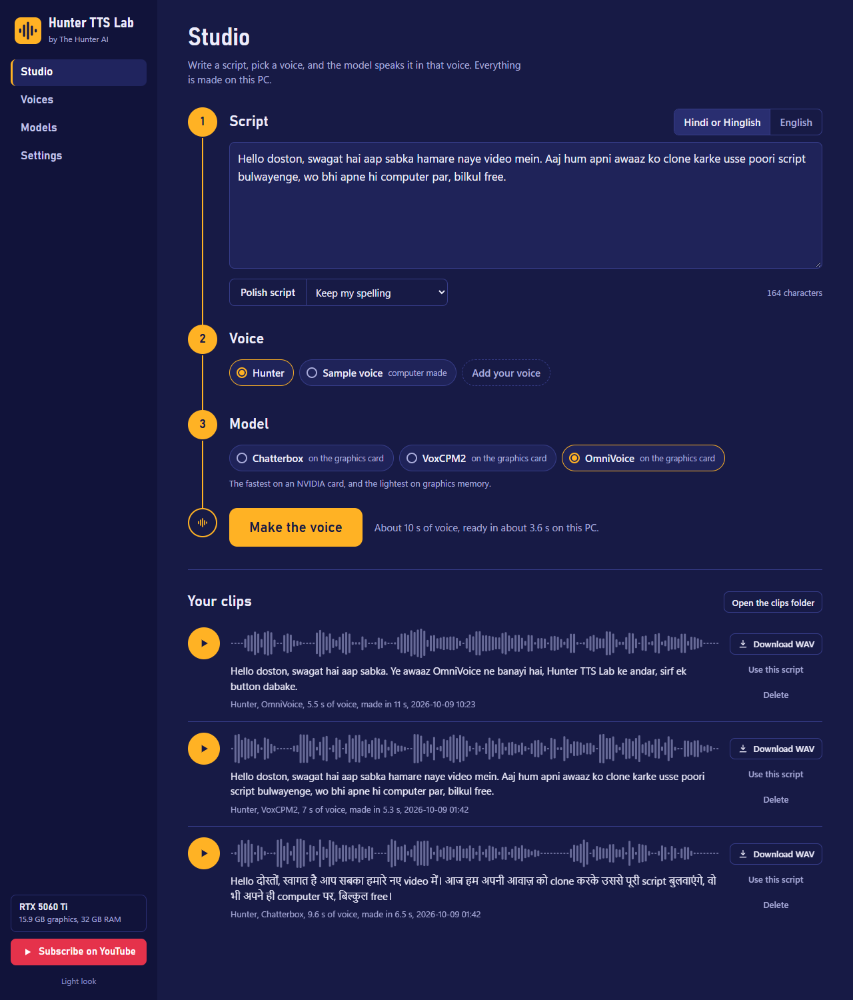
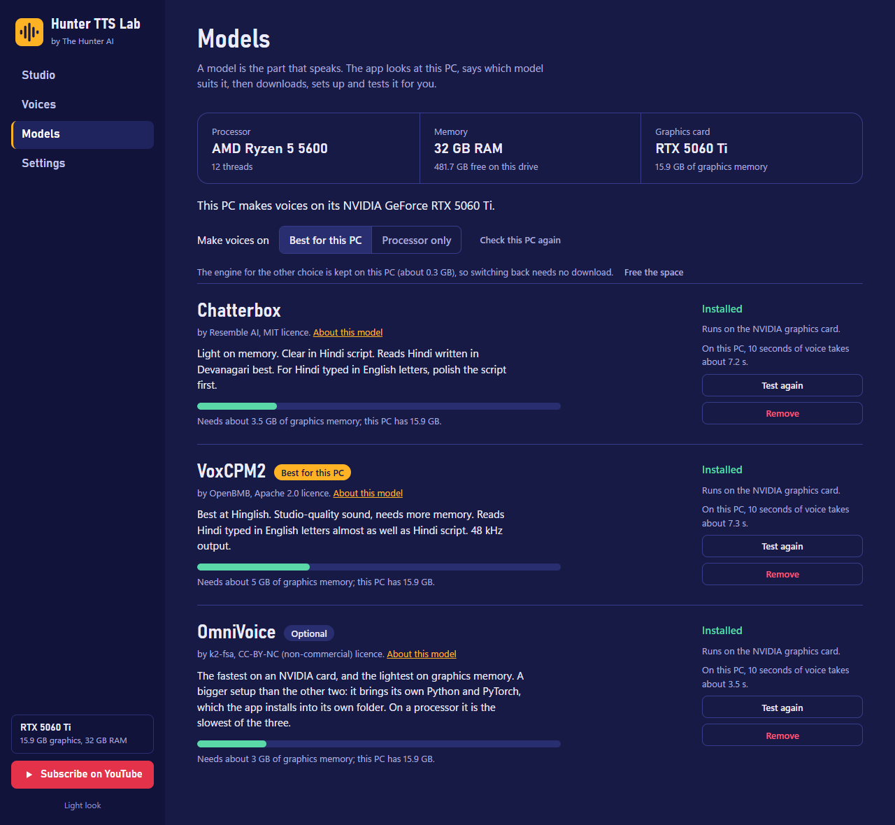

# Hunter TTS Lab

**Built & customized by The Hunter AI** · [Subscribe on YouTube: The Hunter AI](https://www.youtube.com/@TheHunter-AI)

Clone your own voice and make it read any script, on your own PC, for free.
Hindi, Hinglish and English. It works with an NVIDIA graphics card, with an
AMD or Intel card, and on a PC with no graphics card at all.



## What you get

- **Your voice from 5 to 10 seconds of audio.** Record it in the app or pick a
  file. Save it once, use it for every clip.
- **The app checks your PC and tells you what will run.** It reads your
  processor, RAM and graphics memory and marks the model that suits them.
- **One button to install.** It downloads the model, sets up the engine for
  your hardware, and makes a test clip to prove it works. If one way of
  running does not work on your PC, it tries the next by itself.
- **Three models, one of them optional.** Chatterbox and VoxCPM2 need
  nothing but the app. OmniVoice, the fastest on an NVIDIA card, is there
  too if you want it: the app sets up everything it needs by itself.
- **Long scripts are fine.** A script is cut into short pieces, spoken piece
  by piece and joined, with a progress bar and a Cancel button.
- **Script polishing (optional).** Add a free Google Gemini key and the app
  tidies a script before it is spoken: punctuation, numbers as words, and
  Hinglish turned into Hindi script. In our test that took Chatterbox from
  81% of the words heard right to 100%.
- **Download every clip as a WAV file**, ready for your video editor.
- **Private.** Voices, scripts and clips stay on your PC. Nothing is uploaded.
  The only exception is a script you choose to polish, which goes to Google.

## Start in three steps

1. **[Download Hunter TTS Lab (ZIP)](https://github.com/HunterisLive-1/hunter-tts-lab/archive/refs/heads/main.zip)**
   and unzip it. A short place is best, for example `C:\HunterTTSLab`.
   (Or `git clone` this page.)
2. Double-click **`Start Hunter TTS Lab.bat`**. A black window opens and the
   app opens in your browser. Keep the black window open while you use it.
3. Press the **Install** button on the first screen. The app has already
   picked the model that suits your PC; it downloads it, sets it up and
   tests it. Then write your script and press **Make the voice**.

You do not need to install Python or anything else. On its first start the
app fetches a small private copy of Python (11 MB) into its own folder.

**Needs:** Windows 10 or 11 (64-bit), 6 GB of free disk space, and internet
for the first setup. After that it works offline. (The optional OmniVoice
model needs more disk: see below.)

## Which model for which PC

The app decides this for you. For the curious, this is what it goes by:

| Your PC | Model it picks | 10 seconds of voice takes |
|---|---|---|
| NVIDIA card with 8 GB or more | VoxCPM2 | about 5 seconds |
| NVIDIA card with 4 to 6 GB | Chatterbox | about 5 seconds |
| AMD or Intel card with 4 GB or more | Chatterbox, through Vulkan | about 6 seconds |
| No graphics card, 8 GB RAM | Chatterbox, on the processor | about 1 minute |
| No graphics card, 16 GB RAM | Chatterbox, and VoxCPM2 if you want it | about 1 minute |



The times were measured on one PC (Ryzen 5 5600, RTX 5060 Ti 16 GB, 32 GB
RAM). After installing, the Models page shows the time measured on **your**
PC instead. The Vulkan row was measured on the NVIDIA card running through
Vulkan; it has not been tried on an AMD or Intel card yet.

| Model | Good at | Graphics memory for one piece of text | RAM on a processor |
|---|---|---|---|
| **VoxCPM2** (OpenBMB) | Hinglish: it heard 97% of the words right. 48 kHz sound. | 4.7 GB | 9.1 GB |
| **Chatterbox** (Resemble AI) | Hindi script: 96% of the words right. Light on memory. | 3.2 GB | 3.2 GB |

"Words right" means a speech-to-text service listened to the clips and that
share of the given words came back correct, over 5 Hindi and Hinglish texts.

## OmniVoice, the optional third model

OmniVoice (k2-fsa) is the fastest of the three on an NVIDIA card, about 3
seconds for 10 seconds of voice on our test PC, and the lightest on graphics
memory (2.5 GB). Over the same five Hindi and Hinglish texts it got 89% of
the words right, a little under the other two: speed is its strength. It is
optional because it is a bigger setup:

- **It runs on Python and PyTorch, and you install neither.** Press Install
  on the Models page and the app downloads its own copy of both into its
  `data` folder, checks every file, and tests the result. Nothing is
  installed into Windows, and a Python you already have is not touched.
- **It is a bigger download:** about 8 GB on an NVIDIA card and 5.5 GB on a
  PC without one. It keeps about 10 GB of disk (6 GB without an NVIDIA
  card) and needs 17 GB free while it installs (11 GB without one).
- **Its first clip takes a little longer.** The model stays loaded while you
  make clips and is closed after five idle minutes, so it does not sit on
  your graphics memory. The clip after such a pause takes about 10 seconds
  more.
- **Without an NVIDIA card it runs on the processor,** also on a PC with an
  AMD or Intel card: about a minute and a half for 10 seconds of voice, the
  slowest of the three, and it wants 6 GB of free RAM. On those PCs
  Chatterbox is the better choice.
- **It listens to your voice recording once.** OmniVoice needs the words
  spoken in the recording; the app writes them down by itself (with
  Whisper) the first time a voice is used, so you never type them.
- **Its model files are licensed CC-BY-NC by their authors:** free for
  non-commercial use. Chatterbox and VoxCPM2 have no such limit.

## Getting a good clone

- Record in a quiet room. No music, no echo, one person.
- 5 to 10 seconds is enough. In our tests a 14 second sample cloned no better
  than its first 6 seconds.
- Speak the way you want the clips to sound. The model copies mood and speed,
  not only the voice.
- For Chatterbox, Hindi written in Devanagari is read more clearly than Hindi
  typed in English letters. Script polishing can convert it for you: the same
  Hinglish script went from 81% of the words heard right to 100% after it
  (VoxCPM2 was at 98% either way).

## Script polishing with Gemini

1. Get a free API key from [Google AI Studio](https://aistudio.google.com/apikey).
2. Paste it on the **Settings** page and choose a model. The ones Google
   usually offers for free are listed first.
3. In the Studio, press **Polish script**.

The key is stored in the app's `data` folder on your PC and is sent only to
Google. Google decides which models are free and how much you can use them.
If the model you picked has run out of its free limit, the app tries the
next free one by itself and remembers the one that answered.

## Your files

Everything the app creates or downloads is in the `data` folder next to it:
voices, clips, models and settings. Delete that folder to start fresh. To
keep it on another drive, set the environment variable
`HUNTER_TTS_LAB_DATA` to a folder before starting.

## If something goes wrong

- **Windows asks "Are you sure you want to run this?"** That is Windows being
  careful with a file that came from the internet. Choose Run (or More info,
  then Run anyway).
- **You switched to "Processor only" and back.** The engine for the other
  choice is kept on the PC, so switching back needs no download. The Models
  page says how much disk that takes and has a button to free it.
- **A model feels slower than it should.** On the Models page press
  **Test again**. The app times every way of running the engine on your PC
  and keeps the fastest; if your graphics driver was updated since, press
  **Check this PC again** first.
- **Install says a way of running "did not work here".** That is the test
  doing its job; the app moves on to the next way by itself (NVIDIA, then
  Vulkan, then the processor) and tells you which one it kept.
- **"The graphics card ran out of memory."** Close games, video editors and
  other AI tools, then try again. Or switch to Chatterbox, the lighter model.
- **OmniVoice says PyTorch could not find the NVIDIA card.** The graphics
  driver is too old for it. Update the NVIDIA driver, press **Check this PC
  again**, then Install. Until then the app runs OmniVoice on the processor.
- **The OmniVoice install stopped halfway.** Press Install again. It goes on
  from the step it was in; what is already downloaded is not fetched twice.
- **OmniVoice says the app's folder has a long path.** Windows allows 260
  characters for a file's whole path, and PyTorch has deep folders. Move the
  Hunter TTS Lab folder somewhere shorter, for example `C:\HunterTTSLab`.
- **"Needs about 9 GB of free memory and only 6 GB is free right now."**
  Another program is using the PC's memory. Close it and try again; the app
  checks first so that the PC does not freeze halfway.
- **It is very slow.** On a processor about a minute per 10 seconds of voice
  is normal. The Models page shows what your PC really does.
- **The browser page says the app is not answering.** The black window was
  closed. Start the app again.
- **The download stopped.** Press Install again. It continues from where it
  stopped, and every file is checked before it is used.

## For developers

The app is plain Python (standard library only) and plain JavaScript, with no
build step.

```
Start Hunter TTS Lab.bat   gets the private Python on first start, runs the app
app/                       the local server: hardware check, recommendation,
                           downloads, engine install and test, voices, speech
app/omni_engine.py         OmniVoice: its own Python and PyTorch, and the helper
app/omni_worker.py         process that keeps the model loaded between clips
web/                       the page (one HTML, one CSS, one JS file)
tests/                     python -m unittest discover tests
data/                      created at run time, never committed
```

`python app/main.py --no-browser --port 7870` runs it with your own Python
3.10 or newer. What gets downloaded, from where and with which checksum is in
`app/catalog.py`.

## Credits and licences

The app is by **The Hunter AI** and is MIT licensed.

The voices are made by other people's work, which the app downloads from
their own pages: the [audio.cpp](https://github.com/0xShug0/audio.cpp) engine
(ShugoAI, Apache 2.0) with the
[Chatterbox](https://github.com/resemble-ai/chatterbox) (Resemble AI, MIT) and
[VoxCPM2](https://github.com/OpenBMB/VoxCPM) (OpenBMB, Apache 2.0) models.
The optional [OmniVoice](https://github.com/k2-fsa/OmniVoice) (k2-fsa; code
Apache 2.0, model CC-BY-NC) runs on PyTorch, with OpenAI's Whisper to write
down what a voice recording says. Details are in
[THIRD_PARTY.md](THIRD_PARTY.md).

## Use it responsibly

Copy only your own voice, or a voice you have permission to copy. Do not use
a cloned voice to pretend to be someone else.

---

**Built & customized by The Hunter AI** · [youtube.com/@TheHunter-AI](https://www.youtube.com/@TheHunter-AI) · Tutorials, updates and new tools on the channel.
